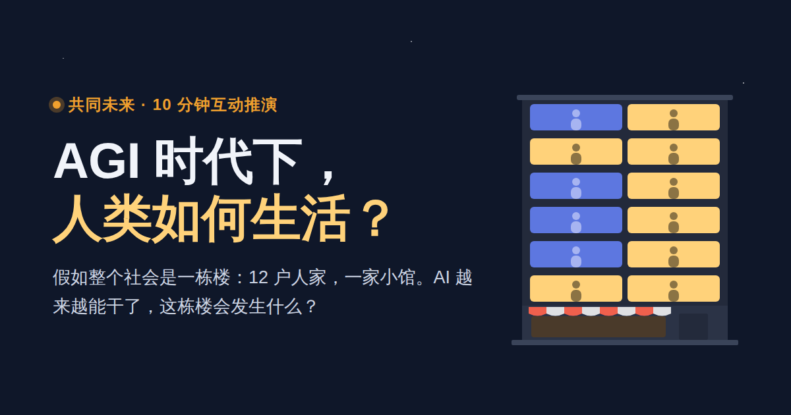

# AGI 时代下，人类如何生活？



共同未来 · 一次 10 分钟的互动推演：假如整个社会是一栋楼，AI 越来越能干以后，这栋楼会发生什么，我们还有哪些选择。手机上每一章都是一屏，滑到就自动演示，想自己玩可以点“自己试试”。

## 打开

- 本地：双击 `index.html`。不需要联网、账户或安装任何东西。
- 在线：https://lisiyuan-cosmoli.github.io/agi-era/

## 内容

- `index.html`：互动推演（中文）。把整个社会比作一栋住着 12 户人家的楼，共八章：节点、AI 敲门、连锁反应、钱怎么转、四种未来、各方能做什么、更远的未来、轮到你。
- `report/`：完整研究报告《AI 不设上限以后，社会如何完成过渡？》，中英双语，14 章、9 张机制图，另有 Markdown 文字版。
- `essay/开放演化的共生文明.md`：关于智能、主体与共同未来的长文，第 07 章由此而来。

## 修改与构建

- `source/story/`：首页的页面、样式和脚本。`tools/build_story.py` 把它们合成单文件 `index.html`。
- `source/report-original/`：中文报告的内容与生成代码。`source/report.en.json`、`source/report-ui.en.json`：英文译文。
- 修改后在仓库根目录执行：

```sh
python3 build.py
```

只用 Python 标准库，运行时不联网。修改中文报告时要同步更新英文译文，构建会列出没有翻译的文字。

## 发布到 GitHub Pages

仓库设置 → Pages → Build and deployment，选择 “Deploy from a branch”，分支选 `main`，目录选 `/ (root)`。根目录已有 `.nojekyll`，文件会按原样发布。

## 分享到 X 等社交平台

页面带有分享卡片（`assets/share.png`，1200×630，源文件是 `tools/share-card.html`）。卡片图片用的是完整网址，默认指向上面的 GitHub Pages 地址。如果换了网址，用新网址重新构建：

```sh
SITE_URL=https://新网址/ python3 build.py
```

## 内容边界

- 图都是示意，不是预测，也没有虚构数据或概率。
- AI 能力持续增长是推演的前提。AGI／ASI 的到来时间、AI 是否具有主体性、未来会走向哪种结果，都没有写成确定的事实。
- 页面不联网、不追踪。首页只在读者自己的浏览器里记住所选的年份。

## 许可

- 代码（HTML 结构、CSS、JavaScript、Python 构建脚本）：MIT，见 `LICENSE`。
- 文字和图像（首页文案与插图、研究报告、长文、分享卡片）：CC BY 4.0，见 `LICENSE-CONTENT.md`。转载或改编时，请注明出处“共同未来 / Futures We Share”并附上仓库链接。
